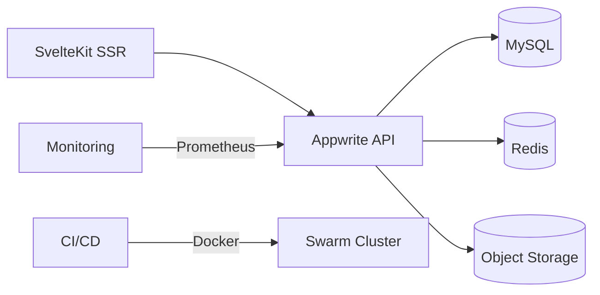

# Green Office Labels Technical Specification

## Problem Analysis

**Current Limitations:**

- Google Forms workflow requires manual:
  - Data aggregation from spreadsheets
  - Version control of questionnaires
  - Progress tracking across organizations
  - Certification generation/management

**Technical Impact:**

- Average 8hr/week spent on data management
- No API for third-party integrations
- Security risks from shared edit access

## User Roles

| Role                | Technical Profile                |
| ------------------- | -------------------------------- |
| Organization Member | Basic web literacy, Mobile users |
| Green Office Admin  | Technical admin capabilities     |
| Auditor             | Read-only API access needed      |

## MVP Feature Matrix

### User Capabilities

1. Authentication:

   - Create organization accounts (Appwrite JWT)
   - Reset passwords via email verification
   - 2FA using TOTP (Time-based One-Time Password)

2. Questionnaire System:
   - Submit answers with draft autosave
   - View submission history
   - Download PDF certificates (PrinceXML)

### Admin Capabilities

1. Content Management:

   - CRUD operations for questions/choices
   - Version questionnaires with SemVer
   - Bulk import/export via JSON

2. Review Workflow:

   - Flag submissions for verification
   - Add private reviewer notes
   - Generate progress reports (CSV/PDF)

3. Access Control:
   - RBAC (Role-Based Access Control)
   - Audit logs retention (90 days)
   - Session invalidation API

## Technical Specifications

**Stack Components:**

- Frontend: SvelteKit (SSR mode)
- BaaS: Appwrite (Auth, Databases, Storage)
- CI/CD: GitHub Actions -> Docker Swarm
- Monitoring: Prometheus/Grafana dashboard

**Performance Targets:**

- API response < 500ms (p95)
- Concurrent users: 500+
- Data export < 30s for 10k records

**Compliance:**

- GDPR Article 32 encryption:
  - AES-256 at rest
  - TLS 1.3+ in transit
- Accessibility:
  - WCAG 2.1 AA compliance
  - axe-core integration in CI

## Deployment Architecture

## Roadmap Integration

**Phase 1 (Current):**

- Implement core questionnaire engine
- Appwrite integration complete
- Basic reporting (reference roadmap.md#L12)

**Phase 2 (Q2):**

- Advanced analytics pipeline
- Webhook integrations
- Rate limiting (reference roadmap.md#L19)

**Validation Metrics:**

- Load testing: 1000 concurrent submissions
- Penetration tests quarterly
- Accessibility audits biannually
